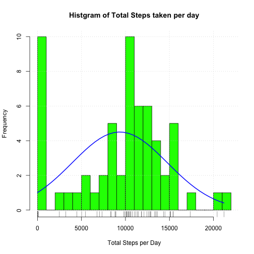
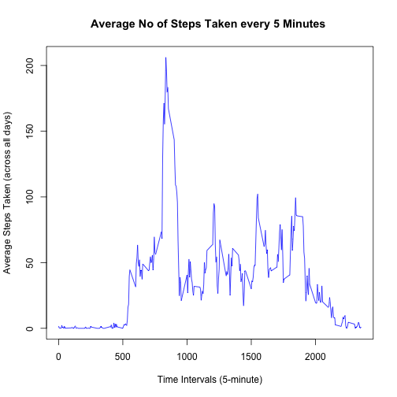
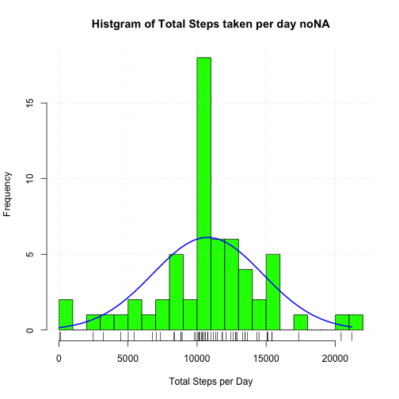

```r
library(lattice)
library(plyr)
library(dplyr)
```
## Loading and preprocessing the data

In this we unzip the activity.zip file which is assumed to be downloaded with the same format that is shown in the notes of the assignment


```r
setwd("~/gitrepos/RepData_PeerAssessment1")
wd=getwd()      
zipfile.name=paste(wd,"/activity.zip", sep="")
unzip(zipfile=zipfile.name, exdir=wd);
activityfile.name=paste(wd,"/activity.csv", sep="")
activity.df <- read.table(file=activityfile.name, header=T, sep=",", stringsAsFactors=F, quote="\"")
activity.df <- mutate(activity.df, date = as.Date(date, "%Y-%m-%d"))
```


## What is mean total number of steps taken per day?

### Histogram of No of days in a day
First step is to make a Histogram of the total number of steps in a day.
Lets see what it shows


```r
step.df <- activity.df %>% group_by(date) %>% summarise(steps.on.the.day = sum(steps, na.rm=T))

with(step.df, {
    h1 <- hist(steps.on.the.day, col="green", xlab="Total Steps per Day",
          ylab="Frequency", main="Histgram of Total Steps taken per day",
          breaks=25)
    rug(steps.on.the.day)
    xfit<-seq(min(steps.on.the.day),max(steps.on.the.day),length=40) 
    yfit<-dnorm(xfit,mean=mean(steps.on.the.day),sd=sd(steps.on.the.day)) 
    yfit <- yfit*diff(h1$mids[1:2])*length(steps.on.the.day) 
    grid(col = "lightgray", lty = "dotted")
    lines(xfit, yfit, col="blue", lwd=2)
    }) 
```

 

### Average and Median values of steps in a day
Following this, lets see at an overall level how many steps did our subject take at an average and as a median value


```r
step.df[step.df$steps.on.the.day == 0,]$steps.on.the.day <- NA
mean.steps <- format(round(mean(step.df$steps.on.the.day, na.rm = T),2),nsmall=2)
median.steps <- median(step.df$steps.on.the.day, na.rm = T)    
mean.steps
```

```
## [1] "10766.19"
```

```r
median.steps
```

```
## [1] 10765
```

So the *mean no of steps per day* is **10766.19** and *median* is **10765**


## What is the average daily activity pattern?

### Time series plot of an "average day" i.e. with averages of every 5 minute interval


```r
interval.data <- activity.df %>% group_by(interval) %>% summarise(steps.in.interval= mean(steps, na.rm=T))
with(interval.data, 
     plot(interval, steps.in.interval, type="l",col="blue",
          xlab="Time Intervals (5-minute)", 
          ylab="Average Steps Taken (across all days)", 
          main="Average No of Steps Taken every 5 Minutes "))
```

 

### Find which interval has highest average number of days over all days

```r
max.steps <- max(interval.data$steps.in.interval)
highest.interval <- interval.data[which.max(interval.data$steps.in.interval), ]$interval
```

The 5 minute interval starting at **835** has the maximum avarage number of steps taken across all days at an average. The no of average steps taken in this 5 minute interval is 206.1698113.


## Imputing missing values

### How many NAs are there in the data

```r
total.na <- sum(is.na(activity.df))
total.na
```

```
## [1] 2304
```
The total number of NAs are **2304**

### Devise a strategy for adjusting missing values
The strategy is to put in mean values for that 5-minute interval over available values.

### Create a new dataset which has missing data filled in


```r
new.df <- activity.df %>% 
            left_join(interval.data, by = "interval")  %>% 
                     within(steps[is.na(steps)] <- steps.in.interval[is.na(steps)]) %>%  select(-steps.in.interval)
total.na.new <- sum(is.na(new.df))
```

The new data frame with values put in from mean for that interval has **0** NA values. 

### Create histogram of total steps taken in a day and calculate mean and median 


```r
new.step.df <- new.df %>% group_by(date) %>% summarise(steps.on.the.day = sum(steps, na.rm=T))
with(new.step.df, {
        h2<- hist(steps.on.the.day, col="green", xlab="Total Steps per Day",
          ylab="Frequency", main="Histgram of Total Steps taken per day noNA",
          breaks=25)
        rug(steps.on.the.day)
        xfit<-seq(min(steps.on.the.day),max(steps.on.the.day),length=40) 
        yfit<-dnorm(xfit,mean=mean(steps.on.the.day),sd=sd(steps.on.the.day)) 
        yfit <- yfit*diff(h2$mids[1:2])*length(steps.on.the.day) 
        grid(col = "lightgray", lty = "dotted")
        lines(xfit, yfit, col="blue", lwd=2)
        rug(new.step.df$steps.on.the.day)
    })
```

 

Lets check the impact on mean and median


```r
new.mean.steps <- format(round(mean(new.step.df$steps.on.the.day, na.rm=T),2),nsmall=2)
new.median.steps <- format(round(median(new.step.df$steps.on.the.day, na.rm=T),2), nsmall=2)
new.mean.steps
```

```
## [1] "10766.19"
```

```r
new.median.steps
```

```
## [1] "10766.19"
```

So the comparison is as follows

Metric | Old Value         | New Value             |
-------|------------------:|----------------------:|
Mean   | 10766.19   | 10766.19   |
Median | 10765 | 10766.19 |

As is evident from above table, the mean remains the same, and median has shifted to mean value. 


## Are there differences in activity patterns between weekdays and weekends?

### Create a new factor variable in the dataset with two levels - "weekday" and "weekend" indicating whether a given date is a weekday


```r
new.days <- new.df %>%
            mutate(day.of.week = as.factor(format(date,"%a")))
new.days$day.of.week <- revalue(new.days$day.of.week, 
                                c("Mon"= "Weekday",
                                  "Tue" = "Weekday",
                                  "Wed" = "Weekday",
                                  "Thu" = "Weekday",
                                  "Fri" = "Weekday",
                                  "Sat" = "Weekend",
                                  "Sun" = "Weekend"))
```


### Make a panel plot containing a time series plot (i.e. type = "l") of the 5-minute interval (x-axis) and the average number of steps taken, averaged across all weekday days or weekend days (y-axis).

```r
new.days.grp <- group_by(new.days, day.of.week, interval)
new.days.avg <- summarize(new.days.grp, avg.steps = mean(steps))
xyplot(avg.steps ~ interval | day.of.week, new.days.avg, type = "l", 
       layout = c(1, 2), xlab = "Interval", ylab = "Number of steps")
```

 

### Weekend vs Weekday analysis

An overview summary of differences has been extracted and shown below for both types of days as a whole (i.e. across all intervals)


```r
#First Interval where avg(steps) > 20 to indicate activity
new.days.grp1 <- group_by(new.days, day.of.week)
new.days.summary <- summarize(new.days.grp1, 
                              avg.steps = mean(steps),
                              min.steps = min(steps), 
                              max.steps = max(steps),
                              median.steps = median(steps), 
                              sd.steps=sd(steps))
mon <- filter(new.days.summary, day.of.week == "Weekday")
sun <- filter(new.days.summary, day.of.week == "Weekend")

tot.mon <- sum(new.days.avg[new.days.avg$day.of.week=="Weekday", ]$avg.steps)
tot.sun <- sum(new.days.avg[new.days.avg$day.of.week=="Weekend", ]$avg.steps)
```

* If we aggregate data only be day type across all intervals, it looks like weekends see more activity 

|Type of Day | Average Steps| Minimum Steps| Maximum Steps| Median Steps| Std Dev|Total Avg Steps in a day|  
|:----------:|-------------:|-------------:|-------------:|------------:|--------:|---------:|
|Weekday|35.6105812| 0|806| 0| 104.2187849|1.0255847 &times; 10<sup>4</sup>|
|Weekend|42.3664013| 0|785| 0| 108.2309534|1.2201524 &times; 10<sup>4</sup>|


* But weekend activity starts later (assuming say >=50 steps in a 5 minute interval is taken as start of reasonable activity)


```r
mon.x <- arrange(new.days.avg, day.of.week, interval, avg.steps) %>% filter(day.of.week == "Weekday" & avg.steps >=50) 
mon.int <- mon.x[1:3,]
sun.x <- arrange(new.days.avg, day.of.week, interval, avg.steps) %>% filter(day.of.week == "Weekend" & avg.steps >=50) 
sun.int <- sun.x[1:3,]
mon.int
```

```
## Source: local data frame [3 x 3]
## Groups: day.of.week
## 
##   day.of.week interval avg.steps
## 1     Weekday      550  50.34927
## 2     Weekday      555  56.26541
## 3     Weekday      605  64.59078
```

```r
sun.int
```

```
## Source: local data frame [3 x 3]
## Groups: day.of.week
## 
##   day.of.week interval avg.steps
## 1     Weekend      805  57.65094
## 2     Weekend      810  88.42925
## 3     Weekend      815  88.75354
```

* Time of Peak average activity is about 40 minutes different


```r
mon1 <- filter(new.days.avg, day.of.week == "Weekday")
sun1 <- filter(new.days.avg, day.of.week == "Weekend")
mon1.max <- max(mon1$avg.steps)
sun1.max <- max(sun1$avg.steps)
mon1.int <- mon1[which.max(mon1$avg.steps), ]$interval
sun1.int <- sun1[which.max(sun1$avg.steps), ]$interval
```

|Type of Day | Max Average in 5 minute Interval| which Interval|
|------------|--------------------------------:|--------------:|
|Weekday| 230.3781971| 835|
|Weekend| 166.6391509| 915|

